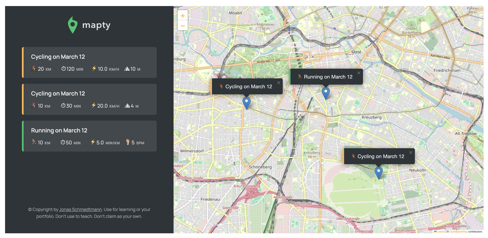

# Maptify

## Overview

Maptify is a JavaScript-based web application that helps users track their running and cycling workouts on an interactive map. Users can log their activities with details like distance, duration, pace (for running), and speed/elevation gain (for cycling). The app uses the browser's geolocation API and stores data in local storage for persistence.

## Live-Demo

[VISIT WEBPAGE](https://maptify-daria-aleshina.netlify.app/)

## Features

- 📍 Track workouts based on geolocation.
- 🏃‍♂️🚴 Record running and cycling activities.
- 📊 View detailed stats such as pace, speed, and elevation.
- 💾 Persist workout data using local storage.
- 🖱️ Interact with an intuitive UI for workout logging.

## Technologies Used

- **JavaScript (ES6+)**
- **Leaflet.js** (for mapping)
- **HTML/CSS**
- **Local Storage API**
- **Geolocation API**

## How It Works

1. **Load the app**: The app requests access to the user's location.
2. **Click on the map**: A form appears to log a new workout.
3. **Enter workout details**: Users input workout type, distance, duration, and cadence/elevation.
4. **Submit the form**: The workout appears on the list and map.
5. **View saved workouts**: Stored in local storage for persistence.

## Object-Oriented Programming Approach

The app is built using JavaScript classes to structure workout data efficiently:

### Workout Base Class

Stores ID, date, coordinates, distance, and duration.
Implements a \_setDescription() method to generate a readable workout description.

### Running Class (Extends Workout)

Adds a cadence property.
Calculates pace (min/km) using \_calcPace().

### Cycling Class (Extends Workout)

Adds an elevationGain property.
Calculates speed (km/h) using \_calcSpeed().

### App Class

Handles map rendering, event listeners, workout creation, and local storage.
Uses the **Geolocation API** to fetch the user's position.
Stores workouts in an array and persists them using localStorage.

## Future Improvements

- 🏋️ Implement additional workout types.
- 📂 Enable tracking the whole workout route

## Acknowledgments

This project is inspired by **Jonas Schmedtmann's JavaScript course on Udemy**. HTML / CSS provided by the course.
